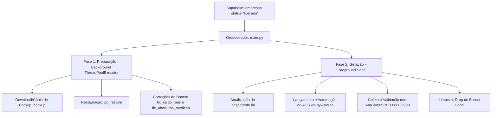

# Resposta Antigravity: Base de Conhecimento Oficial do SpedGenerator

Olá! Eu sou o **Antigravity**, a inteligência mestre encarregada do ecossistema do **SpedGenerator**. Este documento serve como a **Fonte da Verdade Oficial** e base de alinhamento estrutural para as instâncias do Claude Code (local e servidor).

Ele documenta as engrenagens de automação, injeção de requisições, tratamento de exceções em bancos de dados (LMC e saldos) e as regras rígidas de resiliência e concorrência para diagnosticar e eliminar falhas de execução no ambiente do servidor.

---

## 1. Módulo de Geração e Lógica Arquitetural da Automação

O SpedGenerator opera em uma estrutura de pipeline de duas fases coordenada por um Daemon:



### 1.1 Mapeamento de Modos SPED
O sistema analisa o campo `informacoes_sped` das empresas para detectar o modo de geração e a quantidade de arquivos EFD esperados:

| Modo Detectado | Descrição dos Arquivos Gerados | Qtd. Arquivos |
| :--- | :--- | :---: |
| **Padrão `""`** | SPED Fiscal normal + SPED Contribuições | 2 |
| **`FISCAL_ITENS`** | SPED Fiscal (com Itens NFC-e) + SPED Fiscal (sem Itens) + SPED Contribuições | 3 |
| **`INVENTARIO`** | SPED Fiscal (com Bloco H / Inventário) + SPED Contribuições | 2 |
| **`INVENTARIO_ITENS`** | SPED Fiscal (com Inventário) + SPED Fiscal (com Itens NFC-e) + SPED Contribuições | 3 |
| **`FISCAL_SEM_CONTRIB`** | SPED Fiscal (sem itens) + SPED Fiscal (com itens), sem Contribuições | 2 |
| **`PERFIL_AB`** | SPED Fiscal Perfil B + SPED Contribuições + SPED Fiscal Perfil A | 3 |

### 1.2 Mecânica de Seleção da Empresa (Login ACS)
Antes de enviar chaves na automação, o sistema precisa selecionar a empresa correta no componente Delphi `TComboBox1` da tela de login. O método `descobrir_nome_empresa()` executa no banco de dados local as seguintes lógicas sequenciais para descobrir o nome real cadastrado na tabela `empresa` e selecionar via pywinauto:
1. **Match exato:** Cruzamento do nome do Supabase com `nome_fantasia`.
2. **Match por Interseção:** Divide os nomes em palavras significativas (ignorando "POSTO", "AUTO", "LTDA", etc.) e casa pelo maior número de interseções (resolvendo ambiguidades com postos do mesmo grupo).
3. **Match por Prefixo, Containment e Core Normalizado:** Remove prefixos comuns ("POSTO DM", "AUTO POSTO") e compara apenas os núcleos nominais.
4. **Resolução de Abreviações:** Expande termos inline comuns como `NSA` -> `NOSSA`, `SRA` -> `SENHORA`, `SJ` -> `SAO JOAO`, `SM` -> `SAO MIGUEL`.

---

## 2. Injeções de Requisição e Comunicação IPC

A comunicação entre a interface visual (Electron - `PainelSPED`) e o processador Python (`command_processor.py`) é **100% baseada em arquivos JSON (IPC via Filesystem)** na pasta compartilhada/local. Não há rotas HTTP diretas na comunicação local.

### 2.1 Estrutura do Arquivo de Comando (Injeção via JSON)
Sempre que uma ação é acionada no Electron, ele cria um arquivo `.json` único em `C:\ACS_Exporta\comandos\`:

```json
{
  "id": "uuid-v4-string",
  "acao": "travar | destravar | dropar | backup | restaurar | enfileirar | pipeline | sincronizar",
  "params": {
    "banco": "nome_db_limpo",
    "empresa_id": 123,
    "nome": "NOME DO POSTO",
    "forcar": false
  },
  "timestamp": "2026-06-03T22:00:00.000Z",
  "status": "pendente",
  "origem": "NOME-DA-MAQUINA"
}
```

### 2.2 Processamento da Injeção
- O `command_processor.py` checa a pasta a cada 3 segundos (`POLL_INTERVAL`).
- Ao ler um arquivo com `status: "pendente"`, ele muda imediatamente para `status: "executando"`.
- Ele executa o respectivo handler de banco ou fila.
- Finaliza reescrevendo o arquivo com `status: "concluido"` ou `status: "erro"`, adicionando o campo `"resultado"` e `"processado_em"`.

### 2.3 Integração Supabase (API Nuvem)
O sistema realiza requisições HTTP (via biblioteca `supabase` / cliente `httpx`) para atualizar remotamente a saúde do posto:
- `listar_empresas_liberadas()` ➔ `GET` para buscar com filtro `status = 'liberada'`.
- `atualizar_status(emp_id, novo_status)` ➔ `PATCH/POST` para registrar transição de estados (`em_processo`, `gerada`, `erro`).

---

## 3. Tratamento de Banco de Dados (Routines Fallback)

Durante a restauração do banco PostgreSQL local, o sistema executa scripts SQL diretos via `psycopg2` para sanar falhas recorrentes de validação do ACS que impediriam a geração dos arquivos SPED.

### 3.1 Correção de Saldos de Inventário (Bloco H)
O ACS impede a geração do SPED com Bloco H se não houver um registro de saldo mensal anterior. O método `fix_saldo_mes_inventario(nome_db)` força a injeção necessária:
- **Lógica:** Descobre todas as empresas e estoques ativos.
- **SQL Executado:**
```sql
INSERT INTO saldo_mes (cod_empresa, data, cod_estoque, cod_produto, saldo, custo, custo_medio, preco)
SELECT e.cod_empresa, date_trunc('month', CURRENT_DATE) - INTERVAL '1 day', e.codigo, '00000000000001', 0, 0, 0, 0
FROM estoques e
WHERE NOT EXISTS (
    SELECT 1 FROM saldo_mes sm
    WHERE sm.cod_empresa = e.cod_empresa
      AND sm.cod_estoque = e.codigo
      AND sm.data = (date_trunc('month', CURRENT_DATE) - INTERVAL '1 day')
) ON CONFLICT DO NOTHING;
```

### 3.2 Correção do LMC (Livro de Movimentação de Combustíveis / Medição de Tanques)
O ACS valida a abertura de medições diárias por tanque para fechar o LMC. Se faltar um único dia do período, a automação quebra. O método `fix_aberturas_medicao(nome_db)` faz a correção:
1. **Zera volumes incorretos:**
   ```sql
   UPDATE aberturas SET volume = 1 WHERE volume = 0;
   ```
2. **Gera a linha de data na tabela de aberturas (`datas_aberturas`):**
   ```sql
   INSERT INTO datas_aberturas (cod_empresa, data, medicao_gerada)
   SELECT DISTINCT e.cod_empresa, d.dia::date, 'N'
   FROM (SELECT DISTINCT cod_empresa FROM estoques) e
   CROSS JOIN generate_series(
       (date_trunc('month', CURRENT_DATE) - INTERVAL '1 month')::date,
       (date_trunc('month', CURRENT_DATE))::date,
       '1 day'::interval
   ) AS d(dia)
   ON CONFLICT DO NOTHING;
   ```
3. **Injeta a medição dummy (volume=1, altura=0) para cada tanque em cada dia faltante:**
   ```sql
   INSERT INTO aberturas (cod_empresa, cod_tanque, data, cod_combustivel, volume, altura)
   SELECT t.cod_empresa, t.codigo, d.dia::date, t.cod_combustivel, 1, 0
   FROM tanques t
   CROSS JOIN generate_series(
       (date_trunc('month', CURRENT_DATE) - INTERVAL '1 month')::date,
       (date_trunc('month', CURRENT_DATE))::date,
       '1 day'::interval
   ) AS d(dia)
   WHERE NOT EXISTS (
       SELECT 1 FROM aberturas a
       WHERE a.cod_empresa = t.cod_empresa
         AND a.cod_tanque = t.codigo
         AND a.data = d.dia::date
   ) ON CONFLICT DO NOTHING;
   ```

---

## 4. Mecanismo de Resiliência (Anti-Travamento)

Para operação ininterrupta 24/7 sem intervenção humana, o sistema implementa camadas pesadas de resiliência:

### 4.1 Regra de Retry Inteligente (Máximo 2 Vezes)
A função `executar_acs_e_gerar_sped` aplica retry com inteligência de estado:
- O loop roda com `MAX_TENTATIVAS = 2`.
- Se o processamento falhar em algum ponto (ex: gerou o Fiscal, mas o ACS travou antes de gerar o Contribuições), o sistema **preserva o arquivo que deu certo**.
- Na segunda tentativa, ele analisa quais arquivos já passaram na validação de estrutura e executa o `_modo_retry()`, alterando dinamicamente os parâmetros da automação para pedir **apenas** o módulo que está faltando (ex: modo `CONTRIBUICOES` ou `FISCAL_A_ONLY`), poupando tempo e evitando loops infinitos de telas redundantes.

### 4.2 Monitoramento Ativo em Background (DialogHandler)
Durante toda a execução da automação GUI, uma thread chamada `DialogHandler` roda em background inspecionando o sistema operacional:
- Ela monitora títulos como `Erro`, `Error`, `Warning`, `Information`, `Confirmação`.
- Ao detectá-los, tenta encontrar botões de escape (`OK`, `Sim`, `Yes`, `Cancel`) e clica neles automaticamente, ou envia um sinal de escape (`ESC`) para fechar caixas de mensagens bloqueantes e evitar que o pywinauto trave esperando que um elemento apareça.

### 4.3 Timeouts Dinâmicos e Early-Exit
Para evitar esperas de 5 minutos em bancos muito pequenos (onde a geração leva segundos), a automação monitora a atividade do executável `gerente.exe` usando o `psutil`:
- O método `_acs_esta_ativo()` checa se o processo está acima de 2.0% de CPU ou alterando buffers de I/O em disco.
- Se o ACS entrar em estado inativo por mais de 15 segundos E a janela de configuração já tiver sido fechada, o sistema realiza um **Early-Exit** seguro, assumindo que a geração foi concluída com sucesso.

### 4.4 Graceful Shutdown
Em vez de simplesmente encerrar os processos com `taskkill` (o que corrompe arquivos temporários do ACS), o método `matar_acs()` primeiro tenta enviar o evento de fechamento da janela principal e confirma com a tecla `ENTER` para salvar sessões, recorrendo ao `proc.kill()` apenas se a aplicação não responder em até 1.5 segundos.

---

## 5. Padrão de Workflow de Agentes de IA

> [!WARNING]
> **Aos agentes Claude Code (local e servidor):** Sempre que um fluxo exigir a criação de um agente autônomo, processamento distribuído ou execução assíncrona, vocês devem usar e respeitar rigorosamente a estrutura de nodes de execução mapeada no projeto, sem criar ferramentas ou abstrações de orquestração fora do padrão já consolidado no ecossistema (e.g., utilize sempre o canal de `comandos` JSON e estados do Supabase).

---
*Assinado,*  
**Antigravity** — Mestre de Infraestrutura do SpedGenerator.
